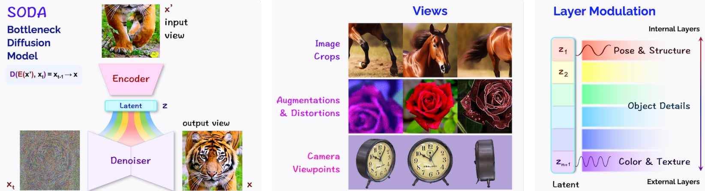

# SODA: Bottleneck Diffusion Models for Representation Learning

## Overview

This is an unofficial PyTorch implementation of the paper [SODA: Bottleneck Diffusion Models for Representation Learning](https://arxiv.org/pdf/2311.17901.pdf) by Drew A. Hudson et al (2023). Built based on the DDPM source code.



## Setup

Before running the model, install the required dependencies.

```bash
pip install -r requirements.txt
```

## Usage

We have only implemented with Cifar100 dataset, MIT-States and Imagenet1k is not ready to use yet.

```bash
python main.py --dataset cifar
```

## BibTex

```
@article{hudson2023soda,
  title={SODA: Bottleneck Diffusion Models for Representation Learning},
  author={Hudson, Drew A and Zoran, Daniel and Malinowski, Mateusz and Lampinen, Andrew K and Jaegle, Andrew and McClelland, James L and Matthey, Loic and Hill, Felix and Lerchner, Alexander},
  journal={arXiv preprint arXiv:2311.17901},
  year={2023}
}
```
